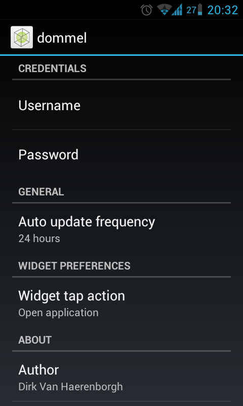

+++
title = "Introducing Dommel Monitor"
date = "2012-04-07"
+++

After a bit of fooling around with Android, I finally got around in finishing my very first app.

Dommel Monitor is a dead simple isp monitor for customers of [dommel.com](http://lianka.schedom-europe.net/). Since dommel does not provide some sort of API for their usage data, this app just logs in on the users dashboard, and parses some webpages to get to the actual data.

So, here's two thousand words:

It's released under GPLv3, and you can find all source on [github](https://github.com/vhdirk/Dommel).
Get it on [Google Play](http://play.google.com/store/apps/details?id=net.qvex.dommel)

Acknowledgements:

Thanks to:

- Lorenzo Bernardi and Ben Van Daele for creating Mobile Vikings for Android and making the source available (<https://redmine.djzio.be/projects/mvfa>); It definitely helped me a lot.
- Jan De Luyck (phptelemeter.kcore.org) for inspiration on parsing the Dommel webpage
- ~tiheum for the [Faenza iconset](http://tiheum.deviantart.com/art/Faenza-Icons-173323228). I took the liberty of using the icon background.
